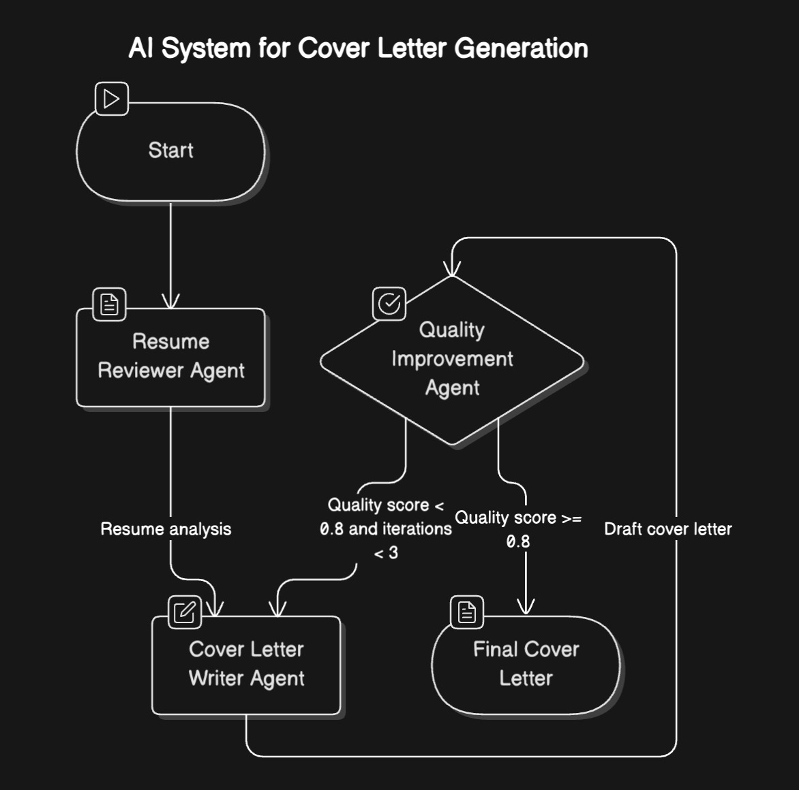

# appl.ai Agentic AI Platform to write cover letters.

The **Agentic AI Platform** is a full-stack application that combines:
- **Front-End**: Built with Vite, React, TailwindCSS.
- **Back-End**: Powered by Flask to serve the frontend.
- **Machine Learning**: Includes AI/ML ChatGPT models for intelligent features (OpenAI)
- **Cloud Technologies**: Azure Container Apps, Docker.

Demo of appl.ai in action: [Demo](https://www.loom.com/share/3bc97ef8b71447fa9f8ac424932e3ece?sid=316fb1f8-4191-4b6f-82b5-84afb8e1d112)

Live Website link: [Hosted Demo](https://shorturl.at/E3jbO)




### Notebook:

Notebook is in `agentic-ai-ml` folder and named `appl.ai.ipynb`.

#### Instructions:

Going to folder `agentic-ai-ml` for installing requirements, run:

```
pip3 install -r requirements.txt
```

For resolving system dependencies, run:

- **Poppler** (for PDF processing):
  ```bash
  brew install poppler

API KEY: Search for `OPENAI_API_KEY` and put your own API key.
We have a sample CV and sample job description ready in the notebook. `Restart Notebook and Run all cells` should be showing all of the steps for generating the cover letter.

For having your own cover letter, add your CV/resume with the name `sample.pdf` and remove the old one. Add the job description on the notebook and run `Restart Notebook and Run all cells`.

### Backend:

The backend is a simple flask API, that hosts two path `/` and `/cover-letter`.

The `/cover-letter` path supports two `--form` parameters `jd` and `resume`.

#### Instructions:

API KEY in .env file: Search for `OPENAI_API_KEY` and put your own API key.

Going to folder `agentic-ai-backend` for installing requirements, run:

```
pip3 install -r config/requirements.txt
```

After completing the requirements installation, run:

```
export FLASK_APP=app.py
flask run app.py --host=0.0.0.0 --port=80 --debug
```

There is a Dockerfile if you want to deploy it in the cloud.

### FrontEnd:

The frontend is a react application written with tailwind, react, vite.

Install Node and NPM:

https://nodejs.org/en/download/package-manager

Run:

```
npm run install
npm run dev
```

There is a Dockerfile if you want to deploy it in the cloud.

